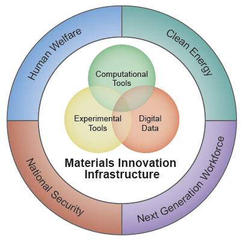

.. WebFF documentation master file, created by
   sphinx-quickstart on Sun Sep 17 12:32:11 2017.
   You can adapt this file completely to your liking, but it should at least
   contain the root `toctree` directive.

WebFF
=====

WebFF is an open and extensible molecular dynamics force-field (FF) repository, designed to support the Materials Genome Initiative (MGI) for organic and related soft materials. The repository is built using the NIST **Materials Data Curation System (MDCS)** [`link <https://mgi.nist.gov/materials-data-curation-system>`__] which supports ontology based database descriptions using XML schema. 

Features
--------

Here are some of the main features of WebFF:

* Users interact with the repository through two main portals. The **Data Exploration Portal** [`link <https://webff.nist.gov/explore>`__] supports search for force-field data based on the curated metadata descriptors and download in a number for common formats. We will work with the user community to expand output format coverage per user requests.

* The **Data Curation Portal** [`link <https://webff.nist.gov/curate>`__] supports upload of published force-field data with appropriate metadata descriptors to support provenance based data sharing. New datasets may be curated interactively or using a python based toolset to upload large datasets en masse. Data curation requires an authorized account.

* The initial release of the repository features three integrated XML schemas:
	1. Class I organic force-fields in such as OPLS, Amber and CHARMM style representations
	2. Class II style force-fields such as CFF, PCFF, COMPASS and TEAMFF
	3. Coarse-Grained models at various levels of granularity

* For questions, comments and requests please contact: webff@nist.gov 

**If you use data from WebFF in your work, we ask that you please cite the following:**

    1. The main source or the data cited in the XML metadata 

    2. Frederick R. Phelan Jr., Kathleen Mullin, Pablo Garcia Beltran, Gule Teri, Priyanshu Mishra and Huai Sun, "The Web Force-Field (WebFF) Project: Ontology Based Force-Field Repository for Soft Materials at Multiple Levels of Granularity," in preparation (2018).

External Resources
==================
.. csv-table:: 

    WebFF-Documentation, |GitHub-WebFFDocs|
    Materials Data Curation System (MDCS), |GitHub-MDCS|

.. |GitHub-WebFFDocs| image:: ../images/GitHub.svg
    :width: 100px
    :target: https://github.com/usnistgov/WebFF-Documentation

.. |GitHub-MDCS| image:: ../images/GitHub.svg
    :width: 100px
    :target: https://github.com/usnistgov/MDCS

Table of Contents
=================

.. toctree::
    :maxdepth: 1
    :caption: Introduction 

    Overview

.. toctree::
    :maxdepth: 2
    :caption: Documentation

    XML Schema Descriptions
	Data Search, Download and File Conversion
	Uploading Data using WebFF.py

.. toctree::
    :maxdepth: 2
    :caption: Reference

	Metadata
	Atom Types
    Bond Potentials
    Angle Potentials
    Dihedral Potentials
    Improper Potentials
	Non-Bond Potentials

.. toctree::
    :maxdepth: 2
    :caption: Miscellaneous 

    Publications
    Contribute
    Contacts
    Legal
