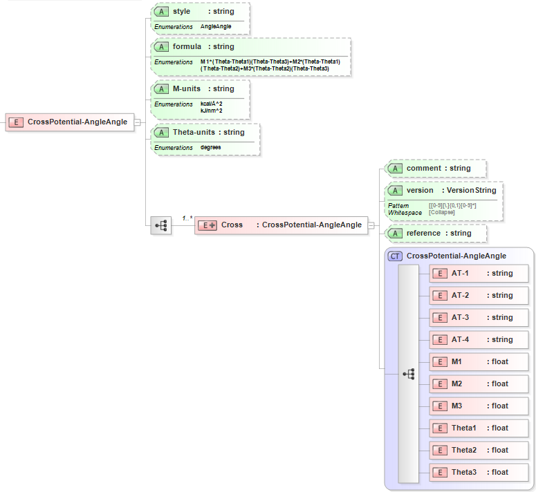

.. _Cross-AngleAngle:

Cross: Angle-Angle  
==================

Functional Form
---------------

The **Angle-Angle Cross Potential** has the functional form:

:math:`E={{M}_{1,ijkl}}\left( {{\theta }_{ijk}}-{{\theta }_{1,ijk}} \right)\left( {{\theta }_{kjl}}-{{\theta }_{1,kjl}} \right)+{{M}_{2,ijkl}}\left( {{\theta }_{ijk}}-{{\theta }_{1,ijk}} \right)\left( {{\theta }_{ijl}}-{{\theta }_{2,ijl}} \right)`
:math:`\qquad +{{M}_{3,ijkl}}\left( {{\theta }_{ijl}}-{{\theta }_{2,ijl}} \right)\left( {{\theta }_{kjl}}-{{\theta }_{1,kjl}} \right)`

This term is part of the Class2 Improper Potential style. 

The force-field parameters for this potential and units are given by:

========================== ======================================================= ===============
**Equation Symbol**        **Parameter Definition**                                **Units**
-------------------------- ------------------------------------------------------- ---------------
:math:`M_{1,ijkl}`         Cross potential angle coefficient for atoms [i,j,k,l]   energy
:math:`M_{2,ijkl}`         Cross potential angle coefficient for atoms [i,j,k,l]   energy
:math:`M_{3,ijkl}`         Cross potential angle coefficient for atoms [i,j,k,l]   energy
:math:`{\theta }_{1,ijk}`  Equilibrium angle for atoms [i,j,k]                     degrees
:math:`{\theta }_{2,ijl}`  Equilibrium angle for atoms [i,j,l]                     degrees
:math:`{\theta }_{3,kjl}`  Equilibrium angle for atoms [k,j,l]                     degrees
========================== ======================================================= ===============

XML Schema
----------

The XML schema for the **Angle-Angle Cross Potential** has the following representation (design mode representation using Liquid XML Studio):

The relationship between the equation symbols and XML schema notations are given by:

+------------------------------------------------------------+------------------------------+---------------------+
| **Parameter Definition**                                   | **Equation Symbol**          | **Schema Notation** |
+------------------------------------------------------------+------------------------------+---------------------+
| Atom type of atom [i]                                      | :math:`i`                    | AT-1                |
+------------------------------------------------------------+------------------------------+---------------------+
| Atom type of atom [j]                                      | :math:`j`                    | AT-2                |
+------------------------------------------------------------+------------------------------+---------------------+
| Atom type of atom [k]                                      | :math:`k`                    | AT-3                |
+------------------------------------------------------------+------------------------------+---------------------+
| Atom type of atom [l]                                      | :math:`l`                    | AT-4                |
+------------------------------------------------------------+------------------------------+---------------------+
| Cross potential angle coefficient for atoms [i,j,k,l]      | :math:`M_{1,ijkl}`           | M1                  |
+------------------------------------------------------------+------------------------------+---------------------+
| Cross potential angle coefficient for atoms [i,j,k,l]      | :math:`M_{2,ijkl}`           | M2                  |
+------------------------------------------------------------+------------------------------+---------------------+
| Cross potential angle coefficient for atoms [i,j,k,l]      | :math:`M_{3,ijkl}`           | M3                  |
+------------------------------------------------------------+------------------------------+---------------------+
| Equilibrium angle for atoms [i,j,k]                        | :math:`{\theta }_{1,ijk}`    | Theta1              |
+------------------------------------------------------------+------------------------------+---------------------+
| Equilibrium angle for atoms [i,j,l]                        | :math:`{\theta }_{2,ijl}`    | Theta2              |
+------------------------------------------------------------+------------------------------+---------------------+
| Equilibrium angle for atoms [k,j,l]                        | :math:`{\theta }_{3,kjl}`    | Theta3              |
+------------------------------------------------------------+------------------------------+---------------------+

The general attributes (describing the entire data set) are given by:

====================== =============== ===============================================================================================
**General Attributes** **Cardinality** **Value/Definition**               
---------------------- --------------- -----------------------------------------------------------------------------------------------
style                  Fixed           AngleAngle
formula                Fixed           M1*(Theta-Theta1)(Theta-Theta3)+M2*(Theta-Theta1)(Theta-Theta2)+M3*(Theta-Theta2)(Theta-Theta3)
M-units                Required        Enumerations specified in schema
Theta-units            Required        Enumerations specified in schema
====================== =============== ===============================================================================================

The specific attributes (attached to each set of parameters) are given by:

======================= =============== =======================================
**Specific Attributes** **Cardinality** **Value/Definition**               
----------------------- --------------- ---------------------------------------
comment                 Optional        Comment attached to parameter set
version                 Optional        Version number of parameter set
reference               Optional        Reference attached to parameter set 
======================= =============== =======================================

Note that an XML document will be rejected from being entered into the WebFF database if a required attribute is left unspecified. 

References
----------

1. `LAMMPS Class2 Improper Potential w/ Angle-Angle Cross term`_.

2. `SklogWiki COMPASS Force-Field`_.

3. `Liquid XML Studio`_.

.. _LAMMPS Class2 Improper Potential w/ Angle-Angle Cross term: http://lammps.sandia.gov/doc/improper_class2.html

.. _SklogWiki COMPASS Force-Field: http://www.sklogwiki.org/SklogWiki/index.php/COMPASS_force_field

.. _Liquid XML Studio: https://www.liquid-technologies.com/

