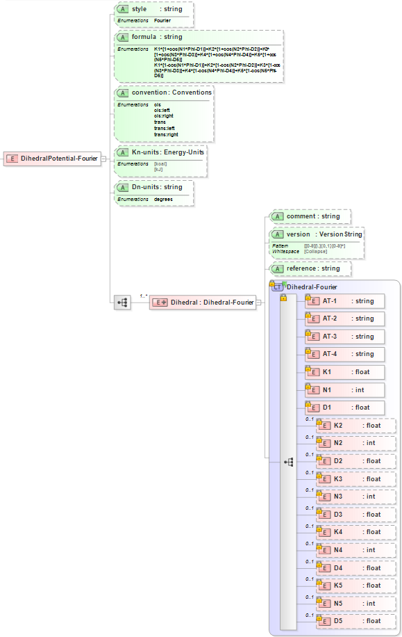

.. _Dihedral-Multiharmonic:

Multi-Harmonic Dihedral  
==================

Functional Form
---------------

The **Multi-Harmonic dihedral potential** has the functional form:

:math:`E = {A_{1,ijkl}+{{A_{2,ijkl}\cos \left( {{\phi}_{ijkl}} \right)}+{{A_{3,ijkl}\cos^{2} \left( {{\phi}_{ijkl}} \right)}+{{A_{4,ijkl}\cos^{3} \left( {{\phi}_{ijkl}} \right)}+{{A_{5,ijkl}\cos^{4} \left( {{\phi}_{ijkl}} \right)}`

The force-field parameters for this potential and units are given by:

====================== ======================================== ================
**Equation Symbol**      **Parameter Definition**                 **Units**
---------------------- ---------------------------------------- ----------------
:math:`K_{1,ijkl}`     Dihedral coefficient for atoms [i,j,k,l] energy
:math:`K_{2,ijkl}`     Dihedral coefficient for atoms [i,j,k,l] energy
:math:`K_{3,ijkl}`     Dihedral coefficient for atoms [i,j,k,l] energy
:math:`K_{4,ijkl}`     Dihedral coefficient for atoms [i,j,k,l] energy
:math:`K_{5,ijkl}`     Dihedral coefficient for atoms [i,j,k,l] energy
:math:`N_{1}`          Nonnegative integer coefficient          N/A
:math:`N_{2}`          Nonnegative integer coefficient          N/A
:math:`N_{3}`          Nonnegative integer coefficient          N/A
:math:`N_{4}`          Nonnegative integer coefficient          N/A
:math:`N_{5}`          Nonnegative integer coefficient          N/A
:math:`D_{1,ijkl}`     Equilibrium Dihedral for atoms [i,j,k,l] degrees
:math:`D_{2,ijkl}`     Equilibrium Dihedral for atoms [i,j,k,l] degrees
:math:`D_{3,ijkl}`     Equilibrium Dihedral for atoms [i,j,k,l] degrees
:math:`D_{4,ijkl}`     Equilibrium Dihedral for atoms [i,j,k,l] degrees
:math:`D_{5,ijkl}`     Equilibrium Dihedral for atoms [i,j,k,l] degrees
====================== ======================================== ================

XML Schema
----------

The XML schema for the **Fourier dihedral potential** has the following representation (design mode representation using Liquid XML Studio):

The relationship between the equation symbols and XML schema notations are given by:

+------------------------------------------------+-----------------------+---------------------+
| **Parameter Definition**                       | **Equation Symbol**   | **Schema Notation** |
+------------------------------------------------+-----------------------+---------------------+
| Atom type of atom [i]                          | :math:`i`             | AT-1                |
+------------------------------------------------+-----------------------+---------------------+
| Atom type of atom [j]                          | :math:`j`             | AT-2                |
+------------------------------------------------+-----------------------+---------------------+
| Atom type of atom [k]                          | :math:`k`             | AT-3                |
+------------------------------------------------+-----------------------+---------------------+
| Atom type of atom [l]                          | :math:`l`             | AT-4                |
+------------------------------------------------+-----------------------+---------------------+
| Dihedral coefficient for atoms [i,j,k,l]       | :math:`K_{1,ijkl}`    | K1                  |
+------------------------------------------------+-----------------------+---------------------+
| Dihedral coefficient for atoms [i,j,k,l]       | :math:`K_{2,ijkl}`    | K2                  |
+------------------------------------------------+-----------------------+---------------------+
| Dihedral coefficient for atoms [i,j,k,l]       | :math:`K_{3,ijkl}`    | K3                  |
+------------------------------------------------+-----------------------+---------------------+
| Dihedral coefficient for atoms [i,j,k,l]       | :math:`K_{4,ijkl}`    | K4                  |
+------------------------------------------------+-----------------------+---------------------+
| Dihedral coefficient for atoms [i,j,k,l]       | :math:`K_{5,ijkl}`    | K5                  |
+------------------------------------------------+-----------------------+---------------------+
| Nonnegative integer coefficient                | :math:`N_{1}`         | N1                  |
+------------------------------------------------+-----------------------+---------------------+
| Nonnegative integer coefficient                | :math:`N_{2}`         | N2                  |
+------------------------------------------------+-----------------------+---------------------+
| Nonnegative integer coefficient                | :math:`N_{3}`         | N3                  |
+------------------------------------------------+-----------------------+---------------------+
| Nonnegative integer coefficient                | :math:`N_{4}`         | N4                  |
+------------------------------------------------+-----------------------+---------------------+
| Nonnegative integer coefficient                | :math:`N_{5}`         | N5                  |
+------------------------------------------------+-----------------------+---------------------+
| Equilibrium dihedral angle for atoms [i,j,k,l] | :math:`D_{1,ijkl}`    | D1                  |
+------------------------------------------------+-----------------------+---------------------+
| Equilibrium dihedral angle for atoms [i,j,k,l] | :math:`D_{2,ijkl}`    | D2                  |
+------------------------------------------------+-----------------------+---------------------+
| Equilibrium dihedral angle for atoms [i,j,k,l] | :math:`D_{3,ijkl}`    | D3                  |
+------------------------------------------------+-----------------------+---------------------+
| Equilibrium dihedral angle for atoms [i,j,k,l] | :math:`D_{4,ijkl}`    | D4                  |
+------------------------------------------------+-----------------------+---------------------+
| Equilibrium dihedral angle for atoms [i,j,k,l] | :math:`D_{5,ijkl}`    | D5                  |
+------------------------------------------------+-----------------------+---------------------+

The general attributes (describing the entire data set) are given by:

====================== =============== =======================================
**General Attributes** **Cardinality** **Value**               
---------------------- --------------- ---------------------------------------
style                  Fixed           Fourier
formula                Fixed           Enumerations specified in schema
convention             Optional        Enumerations specified in schema
Kn-units               Required        Enumerations specified in schema
Dn-units               Required        Enumerations specified in schema
====================== =============== =======================================

The specific attributes (attached to each set of parameters) are given by:

======================= =============== =============================================
**Specific Attributes** **Cardinality** **Definition**               
----------------------- --------------- ---------------------------------------------
comment                 Optional        Comment attached to parameter set
version                 Optional        Version number of parameter set
reference               Optional        Reference attached to parameter set 
======================= =============== =============================================

Note that an XML document will be rejected from being entered into the WebFF database if a required attribute is left unspecified. 

References
----------

1. `LAMMPS Fourier Dihedral Potential`_.

2. `Liquid XML Studio`_.

.. _LAMMPS Fourier Dihedral Potential: http://lammps.sandia.gov/doc/dihedral_fourier.html

.. _Liquid XML Studio: https://www.liquid-technologies.com/

