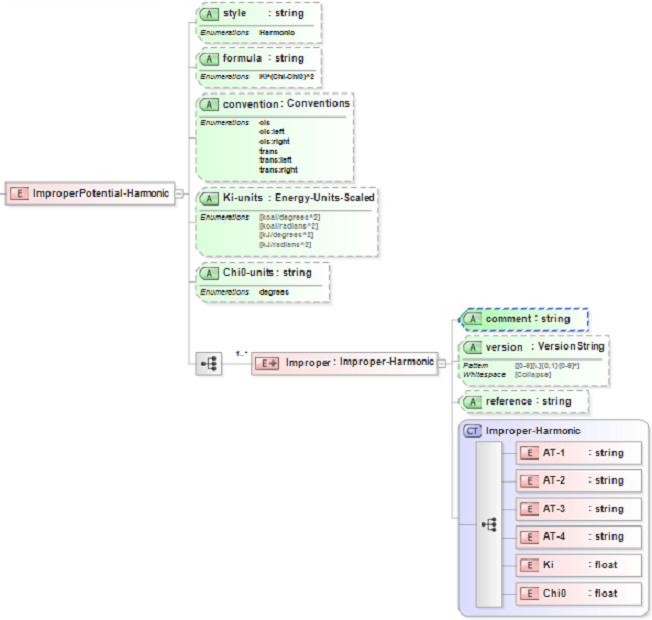

.. _Improper-Harmonic:

Harmonic Improper  
==================

Functional Form
---------------

The **harmonic improper potential** has the functional form:

:math:`E = {K_{i,ijkl}} \cdot \left( {{\chi_{ijkl}} - {\chi_{0,ijkl}}} \right)^2`

The force-field parameters for this potential and units are given by:

====================== ============================================== ================
**Equation Symbol**      **Parameter Definition**                     **Units**
---------------------- ---------------------------------------------- ----------------
:math:`K_{i,ijkl}`     Improper coefficient for atoms [i,j,k,l]       energy/degrees^2
:math:`\chi_{0,ijkl}`  Equilibrium improper angle for atoms [i,j,k,l] degrees
====================== ============================================== ================

XML Schema
----------

The XML schema for the **harmonic improper potential** has the following representation (design mode representation using Liquid XML Studio):

The relationship between the equation symbols and XML schema notations are given by:

+------------------------------------------------+-----------------------+---------------------+
| **Parameter Definition**                       | **Equation Symbol**   | **Schema Notation** |
+------------------------------------------------+-----------------------+---------------------+
| Atom type of atom [i]                          | :math:`i`             | AT-1                |
+------------------------------------------------+-----------------------+---------------------+
| Atom type of atom [j]                          | :math:`j`             | AT-2                |
+------------------------------------------------+-----------------------+---------------------+
| Atom type of atom [k]                          | :math:`k`             | AT-3                |
+------------------------------------------------+-----------------------+---------------------+
| Atom type of atom [l]                          | :math:`l`             | AT-4                |
+------------------------------------------------+-----------------------+---------------------+
| Improper coefficient for atoms [i,j,k,l]       | :math:`K_{i,ijkl}`    | Ki                  |
+------------------------------------------------+-----------------------+---------------------+
| Equilibrium improper angle for atoms [i,j,k,l] | :math:`\chi_{0,ijkl}` | Chi0                |
+------------------------------------------------+-----------------------+---------------------+

The general attributes (describing the entire data set) are given by:

====================== =============== =======================================
**General Attributes** **Cardinality** **Value**               
---------------------- --------------- ---------------------------------------
style                  Fixed           Harmonic
formula                Fixed           Ki*(Chi-Chi0)^2
convention             Optional        Enumerations specified in schema
Ki-units               Required        Enumerations specified in schema
Chi0-units             Required        Enumerations specified in schema
====================== =============== =======================================

The specific attributes (attached to each set of parameters) are given by:

======================= =============== =============================================
**Specific Attributes** **Cardinality** **Definition**               
----------------------- --------------- ---------------------------------------------
comment                 Optional        Comment attached to parameter set
version                 Optional        Version number of parameter set
reference               Optional        Reference attached to parameter set 
======================= =============== =============================================

Note that an XML document will be rejected from being entered into the WebFF database if a required attribute is left unspecified. 

References
----------

1. `LAMMPS Harmonic Improper Potential`_.

2. `GROMACS Harmonic Improper Potential`_ page 77.

3. `Liquid XML Studio`_.

.. _LAMMPS Harmonic Improper Potential: http://lammps.sandia.gov/doc/improper_harmonic.html

.. _GROMACS Harmonic Improper Potential: http://manual.gromacs.org/documentation/2016.3/manual-2016.3.pdf

.. _Liquid XML Studio: https://www.liquid-technologies.com/

