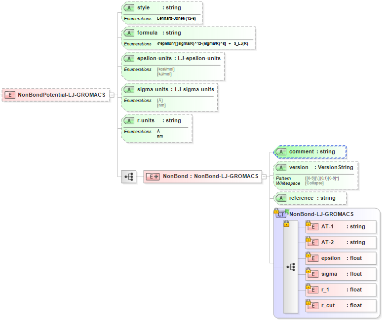

.. _NonBond-LJ:

Non-Bond Lennard-Jones GROMACS Potential  
================================

Functional Form
---------------

The **non-bond Lennard-Jones GROMACS potential** has the functional form:

:math:`E = 4 \cdot {\epsilon} \cdot \left[ {\left( \frac {\sigma}{R_{ij}} \right)^{12}  - \left( \frac {\sigma}{R_{ij}} \right)^{6}} \right] + {S_{LJ}}\left({R_{ij}}\right)`

The force-field parameters for this potential and units are given by:

=================== ============================================= ===============
**Equation Symbol** **Parameter Definition**                      **Units**
------------------- --------------------------------------------- ---------------
:math:`\epsilon`    Potential well depth for atom [i]             energy/mol
:math:`\sigma`      Interatomic cut-off distance for atom [i]     length
=================== ============================================= ===============

XML Schema
----------

The XML schema for the **non-bond Lennard-Jones GROMACS potential** has the following representation (design mode representation using Liquid XML Studio):

The relationship between the equation symbols and XML schema notations are given by:

+-------------------------------------------+---------------------+---------------------+
| **Parameter Definition**                  | **Equation Symbol** | **Schema Notation** |
+-------------------------------------------+---------------------+---------------------+
| Atom type of atom [i]                     | (implicit)          | AtomType            |
+-------------------------------------------+---------------------+---------------------+
| Potential well depth for atom [i]         | :math:`\epsilon`    | epsilon             |
+-------------------------------------------+---------------------+---------------------+
| Interatomic cut-off distance for atom [i] | :math:`\sigma`      | sigma               |
+-------------------------------------------+---------------------+---------------------+
| Inner cut-off distance for atom [i]       |                     | r_1                 |
+-------------------------------------------+---------------------+---------------------+
| Outer cut-off distance for atom [i]       |                     | r_cut               |
+-------------------------------------------+---------------------+---------------------+
The general attributes (describing the entire data set) are given by:

====================== =============== ===============================================
**General Attributes** **Cardinality** **Value/Definition**               
---------------------- --------------- -----------------------------------------------
style                  Fixed           Lennard-Jones (12-6)
formula                Fixed           4*epsilon*[(sigma/R)^12-(sigma/R)^6] + S_LJ(R)
epsilon-units          Required        Enumerations specified in schema
sigma-units            Required        Enumerations specified in schema
r-units                Required        Enumerations specified in schema
====================== =============== ===============================================

The specific attributes (attached to each set of parameters) are given by:

======================= =============== =======================================
**Specific Attributes** **Cardinality** **Value/Definition**               
----------------------- --------------- ---------------------------------------
comment                 Optional        Comment attached to parameter set
version                 Optional        Version number of parameter set
reference               Optional        Reference attached to parameter set 
======================= =============== =======================================

Note that an XML document will be rejected from being entered into the WebFF database if a required attribute is left unspecified. 

References
----------

1. `LAMMPS Lennard-Jones GROMACS Potential`_.

2. `GROMACS Lennard-Jones Pair Potential (Modified non-bonded interactions)`_ page 69.

3. `Liquid XML Studio`_.

.. _LAMMPS Lennard-Jones Pair Potential: https://lammps.sandia.gov/doc/pair_gromacs.html

.. _GROMACS Harmonic Bond Potential: http://manual.gromacs.org/documentation/2016.3/manual-2016.3.pdf

.. _Liquid XML Studio: https://www.liquid-technologies.com/

