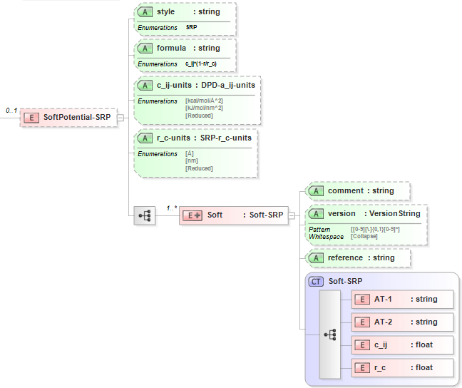

.. _Soft-SRP:

SRP Soft
=============

Functional Form
---------------

The **SRP soft potential** has the functional form:

:math:`E={{C}_{ij}}\left( 1-\frac{{{R}_{ij}}}{{{R}_{c}}} \right)`

The force-field parameters for this potential and units are given by:

=================== ======================================= ===============
**Equation Symbol** **Parameter Definition**                **Units**
------------------- --------------------------------------- ---------------
:math:`C_{ij}`      Coefficient for repulsive force         force
:math:`R_{c}`       Cutoff distance value                   length
=================== ======================================= ===============

XML Schema
----------

The XML schema for the **soft SRP potential** has the following representation (design mode representation using Liquid XML Studio):

The relationship between the equation symbols and XML schema notations are given by:

+-----------------------------------------+---------------------+---------------------+
| **Parameter Definition**                | **Equation Symbol** | **Schema Notation** |
+-----------------------------------------+---------------------+---------------------+
| Atom type of atom [i]                   | :math:`i`           | AT-1                |
+-----------------------------------------+---------------------+---------------------+
| Atom type of atom [j]                   | :math:`j`           | AT-2                |
+-----------------------------------------+---------------------+---------------------+
| Coefficient for repulsive force         | :math:`C_{ij}`      | c_ij                |
+-----------------------------------------+---------------------+---------------------+
| Cutoff distance value                   | :math:`R_{c}`       | r_c                 |
+-----------------------------------------+---------------------+---------------------+

The general attributes (describing the entire data set) are given by:

====================== =============== ====================================================================
**General Attributes** **Cardinality** **Value/Definition**               
---------------------- --------------- --------------------------------------------------------------------
style                  Fixed           SRP
formula                Fixed           c_ij*(1-r/r_c)
c_ij-units             Required        Enumerations specified in schema
r_c-units              Required        Enumerations specified in schema
====================== =============== ====================================================================

The specific attributes (attached to each set of parameters) are given by:

======================= =============== =======================================
**Specific Attributes** **Cardinality** **Value/Definition**               
----------------------- --------------- ---------------------------------------
comment                 Optional        Comment attached to parameter set
version                 Optional        Version number of parameter set
reference               Optional        Reference attached to parameter set 
======================= =============== =======================================

Note that an XML document will be rejected from being entered into the WebFF database if a required attribute is left unspecified. 

References
----------

1. `LAMMPS SRP Pair Potential`_.

2. `Liquid XML Studio`_.

.. _LAMMPS SRP Pair Potential: http://lammps.sandia.gov/doc/pair_srp.html

.. _Liquid XML Studio: https://www.liquid-technologies.com/

