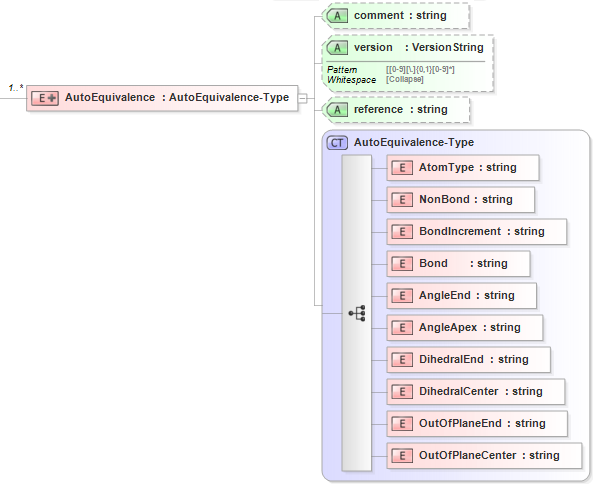

.. Tables:

Table Potentials
================

.. toctree::
   :maxdepth: 1

Bond Increment Table
--------------------

The XML schema for the **bond increment table** has the following representation (design mode representation using Liquid XML Studio):

.. image:: ../../images/Table-BondIncrement.png
	:align: center

The specific elements (describing each set of parameters) are given by:

+-----------------------------------------+---------------------+
| **Parameter Definition**                | **Schema Notation** |
+-----------------------------------------+---------------------+
| Atom type of atom [i]                   | AT-I                |
+-----------------------------------------+---------------------+
| Atom type of atom [j]                   | AT-J                |
+-----------------------------------------+---------------------+
| Increment step size for atoms [i,j]     | Delta-IJ            |
+-----------------------------------------+---------------------+
| Increment step size for atoms [j,i]     | Delta-JI            |
+-----------------------------------------+---------------------+

The specific attributes (attached to each set of parameters) are given by:

======================= =============== =======================================
**Specific Attributes** **Cardinality** **Value/Definition**               
----------------------- --------------- ---------------------------------------
comment                 Optional        Comment attached to parameter set
version                 Optional        Version number of parameter set
reference               Optional        Reference attached to parameter set 
======================= =============== =======================================

Equivalence Table
-----------------

The XML schema for the **equivalence table** has the following representation (design mode representation using Liquid XML Studio):

.. image:: ../../images/Table-Equivalence.png
	:align: center

The specific elements (describing each set of parameters) are given by:

+-----------------------------------------+---------------------+
| **Parameter Definition**                | **Schema Notation** |
+-----------------------------------------+---------------------+
| Atom type of atom [i]                   | AtomType            |
+-----------------------------------------+---------------------+
|                                         | NonBond             |
+-----------------------------------------+---------------------+
|                                         | Bond                |
+-----------------------------------------+---------------------+
|                                         | Angle               |
+-----------------------------------------+---------------------+
|                                         | Dihedral            |
+-----------------------------------------+---------------------+
|                                         | Improper            |
+-----------------------------------------+---------------------+

The specific attributes (attached to each set of parameters) are given by:

======================= =============== =======================================
**Specific Attributes** **Cardinality** **Value/Definition**               
----------------------- --------------- ---------------------------------------
comment                 Optional        Comment attached to parameter set
version                 Optional        Version number of parameter set
reference               Optional        Reference attached to parameter set 
======================= =============== =======================================

Auto-Equivalence Table
----------------------

The XML schema for the **auto-equivalence table** has the following representation (design mode representation using Liquid XML Studio):

The specific elements (describing each set of parameters) are given by:

+-----------------------------------------+---------------------+
| **Parameter Definition**                | **Schema Notation** |
+-----------------------------------------+---------------------+
| Atom type of atom [i]                   | AtomType            |
+-----------------------------------------+---------------------+
|                                         | NonBond             |
+-----------------------------------------+---------------------+
|                                         | BondIncrement       |
+-----------------------------------------+---------------------+
|                                         | Bond                |
+-----------------------------------------+---------------------+
|                                         | AngleEnd            |
+-----------------------------------------+---------------------+
|                                         | AngleApex           |
+-----------------------------------------+---------------------+
|                                         | DihedralEnd         |
+-----------------------------------------+---------------------+
|                                         | DihedralCenter      |
+-----------------------------------------+---------------------+
|                                         | OutOfPlaneEnd       |
+-----------------------------------------+---------------------+
|                                         | OutOfPlaneCenter    |
+-----------------------------------------+---------------------+

The specific attributes (attached to each set of parameters) are given by:

======================= =============== =======================================
**Specific Attributes** **Cardinality** **Value/Definition**               
----------------------- --------------- ---------------------------------------
comment                 Optional        Comment attached to parameter set
version                 Optional        Version number of parameter set
reference               Optional        Reference attached to parameter set 
======================= =============== =======================================
