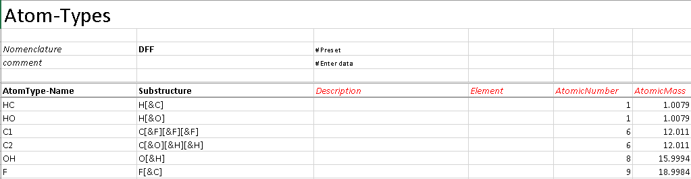
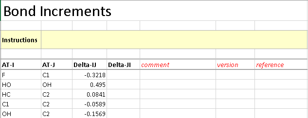
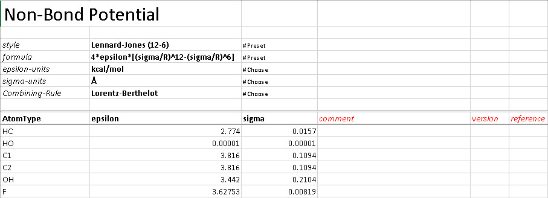
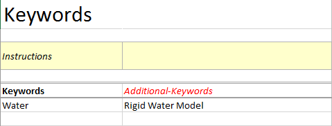

.. _Contribute:

Tutorial
========

The Martini Coarse-Grained Force-Field
--------------------------------------

In this tutorial, we show step by step how to curate data for the Martini Coarse-Grained Force-Field into WebFF using the WebFF Excel data template and the WebFF.py Python library. 

| Martini Force-Field Data Source

.. figure:: ../images/Martini_main_reference_PDF.png
	
	
.. figure:: ../images/itp_screenshot.png
	

	

| WebFF Excel Spreadsheet Data Entry

The data for the Martini force-field was ported to the Excel spreadsheet called: \WebFF-Documentation\XML\Coarse-Grained\WebFF-CoarseGrained-DataTemplate.xlsx 

| Metadata

There are three sections of Metadata to include

.. figure:: ../images/CG_template_Metadata.png
	

.. figure:: ../images/CG_template_Keywords.png

.. figure:: ../images/CG_template_References.png

| Atom Types

The atom types for Martini are general in nature, and each entry can stand for a number of similar but related chemical moeities. 

.. figure:: ../images/CG_template_AtomTypes.png
	

| Potentials

.. figure:: ../images/CG_template_Bonds.png
	

.. figure:: ../images/CG_template_Angles.png

.. figure:: ../images/CG_template_NonBonds.png
	

| Excel to XML Conversion

.. figure:: ../images/Python_cmd_line_Excel_to_XML.png
	

Atomistic Force-Field Data
--------------------------

| TFE Force-Field Data Source

.. figure:: ../images/Class1_Tutorial_MainReference_Screenshot.png

| Metadata

.. figure:: ../images/Class1_Tutorial_Metadata_Screenshot.png

| Atom Types and Attributes

.. figure:: ../images/Class1_Tutorial_AtomAttributes-DFF_Screenshot.png

| Potentials

.. figure:: ../images/Class1_Tutorial_BondPotential_Screenshot.png

.. figure:: ../images/Class1_Tutorial_AnglePotential_Screenshot.png

.. figure:: ../images/Class1_Tutorial_DihedralPotential_Screenshot.png

Water Models
------------

| Metadata

.. figure:: ../images/TIP3P_tutorial_Journal_Reference.png

.. figure:: ../images/TIP3P_tutorial_Metadata.png

| 3-site

.. figure:: ../images/TIP3P_tutorial_3-site_Rigid.png

References
----------

#. Siewert J. Marrink, H. Jelger Risselada, Serge Yefimov, D. Peter Tieleman, and Alex H. de Vries, "The MARTINI Force Field:  Coarse Grained Model for Biomolecular Simulations," J. Phys. Chem. B, 111 (27), pp 7812–7824, (2007). 

#. Martini v2.2 Force-Field Parameters, http://www.cgmartini.nl/images/parameters/ITP/martini_v2.2.itp

#. Jiří Vymětal and Jiří Vondrášek, "Parametrization of 2,2,2-Trifluoroethanol Based on the Generalized Amber Force Field Provides Realistic Agreement between Experimental and Calculated Properties of Pure Liquid as Well as Water-Mixed Solutions", J. Phys. Chem. B, 118 (35), pp 10390–10404, (2014).

#. William L. Jorgensen, Jayaraman Chandrasekhar, Jeffry D. Madura, Roger W. Impey and Michael L. Klein, "Comparison of simple potential functions for simulating liquid water",  J. Chem. Phys., 79 (2), pp. 926–935, (1983).

