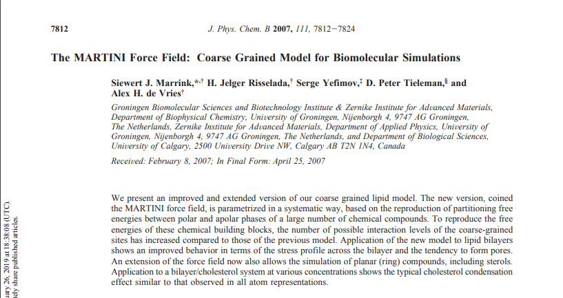
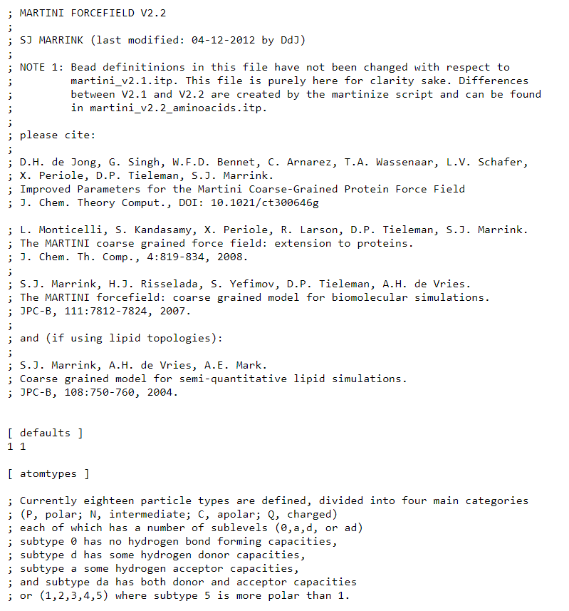
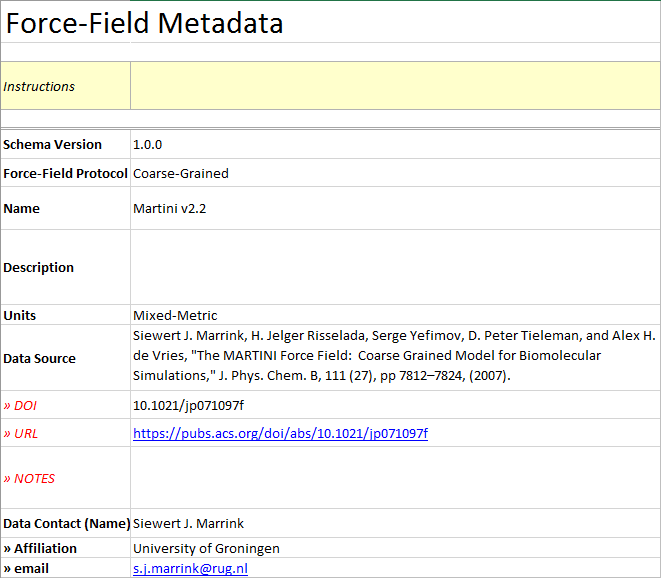
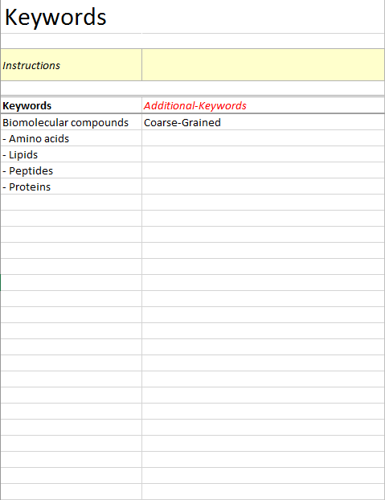
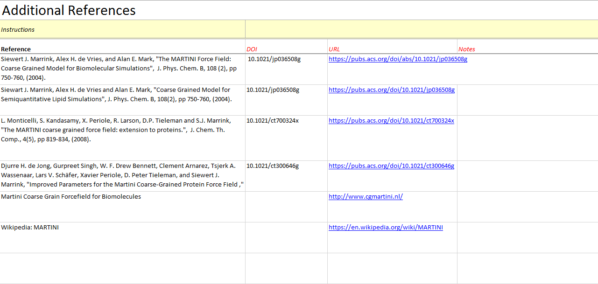
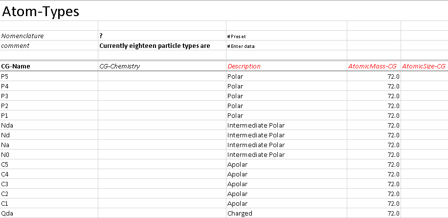
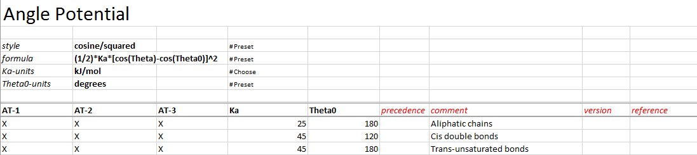

.. _Contribute:

Tutorial
========

The Martini Coarse-Grained Force-Field
--------------------------------------

In this tutorial, we show step by step how to curate data for the Martini Coarse-Grained Force-Field into WebFF using the WebFF Excel data template and the WebFF.py Python library. 

Martini Force-Field Data Source

	

WebFF Excel Spreadsheet Data Entry

The data for the Martini force-field was ported to the Excel spreadsheet called: \WebFF-Documentation\XML\Coarse-Grained\WebFF-CoarseGrained-DataTemplate.xlsx 

Metadata

There are three sections of Metadata to include

Atom Types

The atom types for Martini are general in nature, and each entry can stand for a number of similar but related chemical moeities. 

Potentials 

.. image:: ../images/CG_template_Bonds.png
	:align: left

.. image:: ../images/CG_template_NonBonds.png
	:align: left

Excel to XML Conversion 

.. image:: ../images/Python_cmd_line_Excel_to_XML.png
	:align: left

Atomistic Force-Field Data
--------------------------

(coming soon)

References
----------

#. Siewert J. Marrink, H. Jelger Risselada, Serge Yefimov, D. Peter Tieleman, and Alex H. de Vries, "The MARTINI Force Field:  Coarse Grained Model for Biomolecular Simulations," J. Phys. Chem. B, 111 (27), pp 7812–7824, (2007). 
#. 

